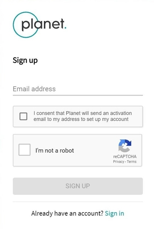
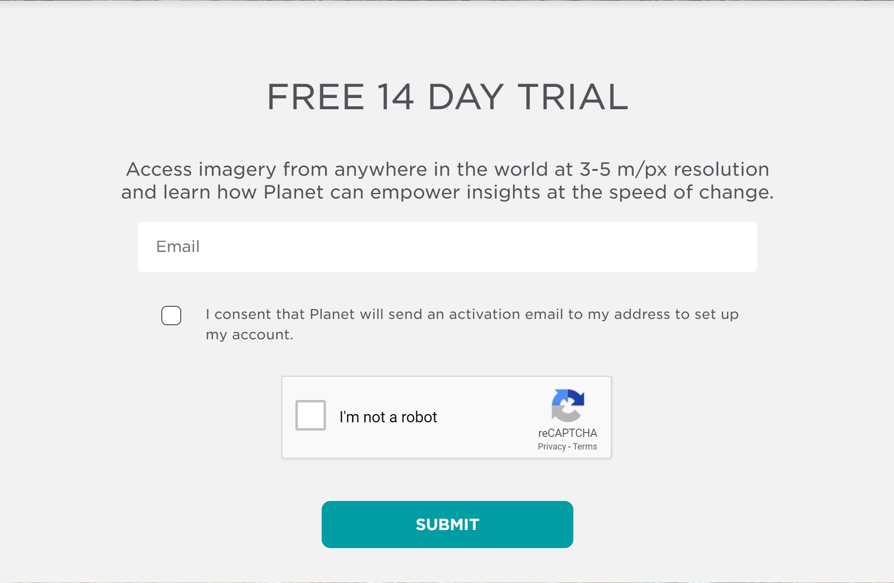
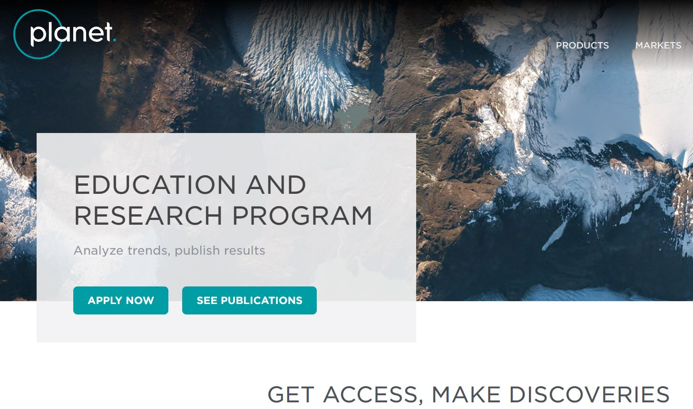

# Registering for a Planet account

What you need first to get started in simply to register for a Planet account.

## Basic Account
To sign up, visit [planet.com/explorer](https://www.planet.com/explorer/). From there, click **[Sign Up](https://www.planet.com/login/?mode=signup)** and enter your email address to receive an invitation:

Check your email &amp; follow the directions to complete the registration process.

## Trial Account
If you need an account in a hurry register for the [Trial account](https://www.planet.com/trial/), gives you 14 day global access with some limits. Once the trial ends you can still browse using the Planet Explorer and purchase a license or subscription.

## Education and Research users
If you are a university researchers, academics, and/or  scientists, your free account allows you to download 10,000 square kilometers of data for non commercial use, every month, anywhere in the world. You can apply for [Education and Research account here](https://www.planet.com/markets/education-and-research/). If you are at a campus with a campus license and partnership with Planet or if your department or research group has a department license contact your person of interest to get access.

## Find your API Key
[Planet Explorer](https://www.planet.com/products/explorer/) is a powerful tool for exploring Planet's catalog of daily imagery and worldwide mosaics
directly in your browser. It's also your gateway to creating a Planet Account,and gaining access to Planet's APIs. To use Planet's APIs, you'll need an API key. API keys are available to all registered users with active Planet accounts.Once you're signed up, log in to
[planet.com/account](https://www.planet.com/account/) to get your API key. Find the **API key** field under your account information, as seen here:

Account information (not a real API key)

## Registering for a Google Earth Engine Account
If you don’t have a developer account [sign up for one here](https://signup.earthengine.google.com/) and make sure you follow the [instructions](https://developers.google.com/earth-engine/python_install_manual) to install the python CLI.

The API and the CLI gets updated frequently and as does the install process as needed so you can read the latest instructions at the page.

## Registering for an Allen Coral Atlas Account

Navigate to https://allencoralatlas.org/ and click on Sign In ; use the **Don't have an account, register for free**

## Getting Help with Planet and Google Earth Engine
Both Planet and Google Earth Engine maintain a developer page for you to find out more information,test tutorials along with housing a few quick FAQ(s)

You can find [Planet Developer Site here](https://developers.planet.com/)

You can find the [Planet Community Cener here](https://support.planet.com/hc/en-us/community/topics)

and of course the [Earth Engine Developers Page](https://developers.google.com/earth-engine/)
